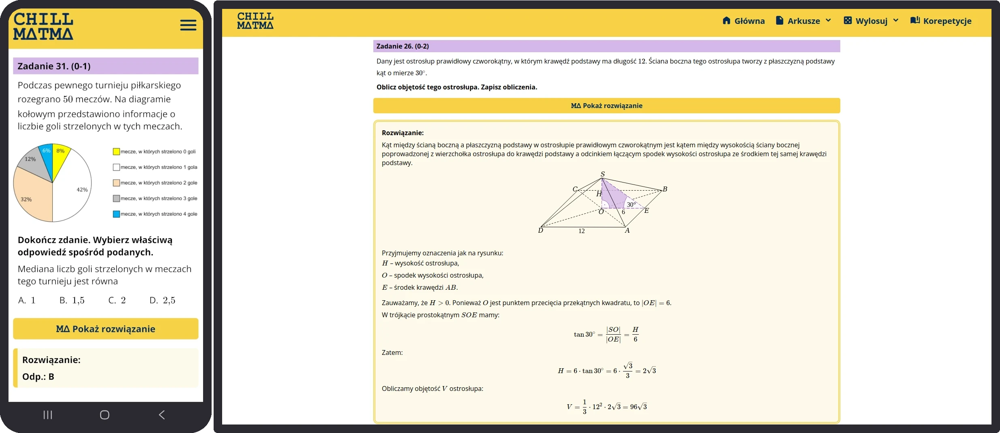

### Introduction
[Chill Matma](https://chillmatma.pl/) is my biggest web development project yet. The idea is simple, I am trying to make it easier for Polish highschool students to prepare for the Matura final exam. My website aggregates past exam sheets and makes it easier to learn from them as much as possible. The website is available under a custom .pl domain [chillmatma.pl](https://chillmatma.pl/)

### Framework
The website runs on the Django Python framework. It was a great choice as it enabled me to develop the website really fast and make use of my python experience. The integrated SQLite database and models philosophy are great for tweaking the content and its attributes.
### Backend & Architecture
The website uses Gunicorn as a worker server alongside the Nginx web server. For now, I am hosting it myself as part of [my Homelab project](). The setup consists of two Docker containers (Django and Nginx) running on a minimal Alpine Linux installation. All traffic is routed through a Cloudflare proxy, using the Cloudflare tunnel service running on a third Docker container.
### Frontend
The frontend consists of pure HTML, CSS, and JavaScript. Mathematical formulas and equations are rendered using the KaTeX library.
### Plans for the future
I would like to implement a custom exam sheet builder that can also generate downloadable PDFs. It would be a great way of leveraging the existing database of exam tasks.
