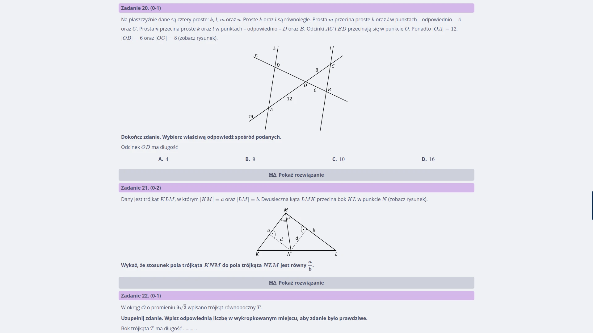
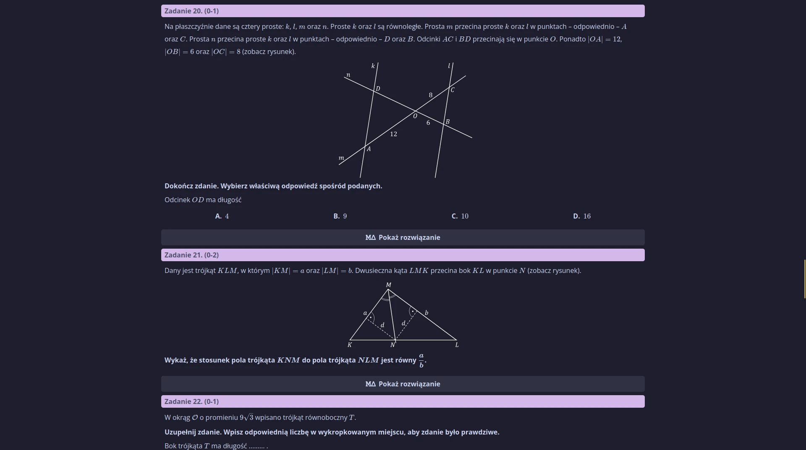

[Chill Matma](https://chillmatma.pl/) is my biggest web development project yet. The idea is pretty simple, I am trying to make it easier for Polish highschool students to prepare for the Matura final exam. My website aggregates past exam sheets and makes it as easy as possible to learn from them. Try it now at [chillmatma.pl](https://chillmatma.pl/)!

## What makes my service stand out?

Chill Matma offers a great experience of learning from official Matura exam sheets. Every exam sheet and task is dynamically styled and adjusted to adapt to your current device. This eliminates the constant need to adjust the traditional PDF view in which the exam sheets are usually available.

Another great feature is the capability to randomly revise official exam sheets and tasks. Ensuring familiarity with as many real past tasks as possible in a flashcard-like style is a great way to study and get familiar with every type of exam question.

It's free! All of this is available for free on the web, right now.

## Backend

### Framework

The website runs on the Django Python framework. It is a great choice that enables me to develop the website fast and make use of my python experience. The integrated SQLite database alongside with Django's models are great for tweaking the website's contents and their attributes.

### Hosting

The website uses Gunicorn as a worker server alongside the Nginx web server. For now, I am hosting it myself as part of [my Homelab project](). At the moment the whole website is handled by a minimal Alpine Linux virtual machine running under Proxmox. The VM is configured with a single core (two threads) of my Intel i3-10100 and 2GBs of RAM.

The software setup consists of two Docker containers (Django and Nginx). All traffic is routed through a Cloudflare proxy, using the Cloudflare tunnel service on a third Docker container.

### Security and remote access

The machine's firewall is set to block traffic on all ports. All maintenance and uploads are carried out over ssh via my Tailscale network. This ensures a good level of security. Network requests come in only through the Cloudflare Tunnel, and the Tailscale network is accesible only to me.

### Uploads

Because of the complicated model structure of an exam sheet in my database, I employ a custom python script that imports the initial exam sheet content and structure from a json file. I mainly use it remotely and input them through scp and ssh.

## Frontend

The front-end consists of pure HTML, CSS, and JavaScript. Mathematical formulas and equations are rendered using the KaTeX library.

The whole layout is dynamic and scales well with different screen sizes. The navigation menu has both a desktop and a mobile version. The exam sheet view takes advantage of the dynamic scaling especially well. The task instructions and answers nicely wrap around, Images scale, and multiple choice elements shift around to take advantage of available space.

## Plans for the future

- I would like to implement a custom exam sheet builder that can also generate downloadable PDFs. It would be a great way of leveraging the existing database of exam tasks.
- I am planning on implementing more security measures and geoblocking, whenever i start to handle user input and user data.
